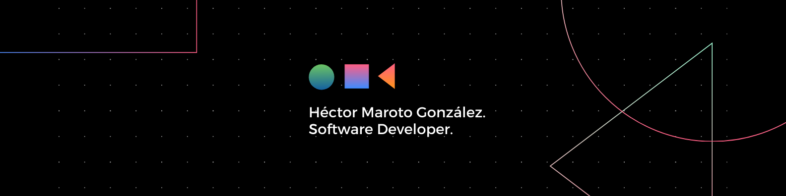

<h1>Hi, I’m @HectorMaroto </h1>
<h2>I’m Software Developer 💻🌐</h2>

> [!NOTE]
> I’m looking for working on tech companies as a Full-Stack developer | Frontend developer | Backend developer | Software developer

> [!TIP]
> - How to reach me : hecmar548@gmail.com | hmaroto02@gmail.com
> - You can also find me on <a href="https://linkedin.com/in/héctor-maroto-gonzález-06a0432b6">LinkedIn</a>

<!---
HectorMaroto/HectorMaroto is a ✨ special ✨ repository because its `README.md` (this file) appears on your GitHub profile.
You can click the Preview link to take a look at your changes.
--->

<h1>Tech Stack</h1>

 

 

 

 

---
